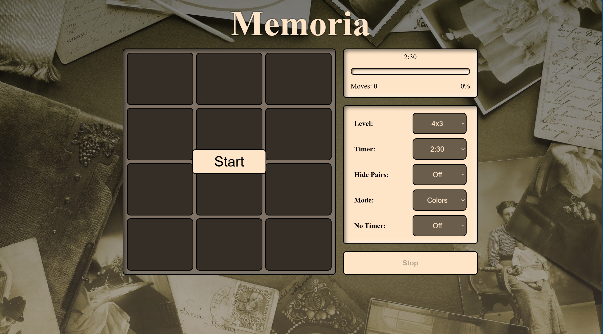
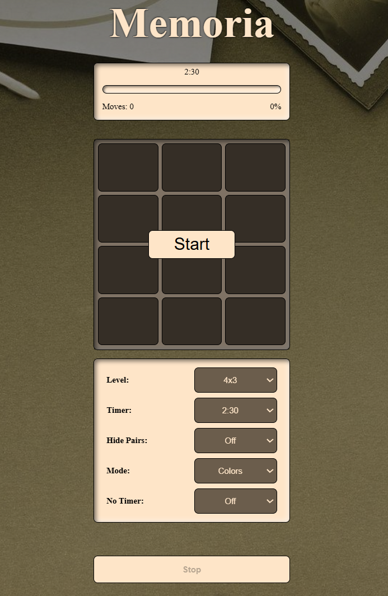

# 🚀 Memoria  

A fun and interactive **Memory Game** using images and colors to test your focus and pattern recognition skills. 🧠  
Flip the cards, match pairs, and challenge yourself in different modes and difficulty levels!  

---

## 📑 Table of Contents  
- [About](#-about)  
- [Features](#-features)  
- [Screenshots](#-screenshots)  
- [Tech Stack](#-tech-stack)  
- [Installation](#-installation)  

---

## 📘 About  
**Memoria** is a browser-based memory game built with **HTML**, **CSS**, and **JavaScript**.  
It’s designed to sharpen memory and attention while providing a simple yet engaging gaming experience.

**🎯 Purpose:**  
To develop a fun and responsive game that enhances memory recall through matching cards, while improving my proficiency in vanilla JavaScript.

**💡 Inspiration:**  
Inspired by traditional memory match games, Memoria was developed as a way to practice DOM manipulation, JavaScript logic, and UI design.

---

## ✨ Features  
- 🎮 **Difficulty Levels** — Adjust the challenge to your liking.  
- ⏱️ **Set Timer** — Race against time to match all pairs.  
- 🙈 **Hidden Pairs** — Match cards by memory alone.  
- 🎨 **Mode Selection** — Switch between Color and Image modes.
  
---

## 🖼️ Screenshots  

 💻 Desktop Gameplay | 📱 Mobile View |
|:--------:|:------------------:|:--------------:|
|  | 

> _Tip: Place your screenshots inside a `/screenshots` folder in your project directory._

---

## 🧰 Tech Stack  
**Frontend:**  
- HTML  
- CSS  
- JavaScript  

**Tools Used:**  
- Visual Studio Code  
- Git & GitHub  

---

## ⚙️ Installation  
Run the project locally in a few simple steps:

```bash
# Clone the repository
git clone https://github.com/your-username/memoria.git

# Navigate into the project folder
cd memoria

# Open the game in your browser
start index.html
